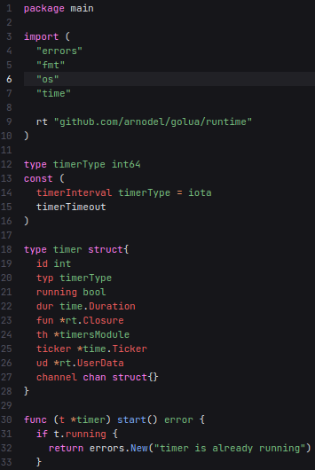
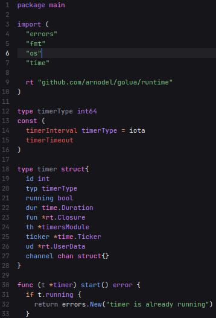

# Evergreen
> 🌳 Treesitter support for Lite XL.

Evergreen adds Treesitter syntax highlighting support for Lite XL.
It is work in progress, but functions well.

> **Warning**
> Evergreen is only tested on Linux and will definitely not work on Windows.

# Showcase

| Without Evergreen                              | With Evergreen                                 |
| ---------------------------------------------- | ---------------------------------------------- |
|                                 |                                  |

# Supported Languages
- [x] [C][tree-sitter-c]
- [x] [C++][tree-sitter-cpp]
- [ ] CSS
- [x] [D][tree-sitter-d]
- [x] [Diff][tree-sitter-diff]
- [x] [Go][tree-sitter-go]
- [x] [go.mod][tree-sitter-go-mod]
- [ ] HTML
- [x] [Javascript/JSX][tree-sitter-javascript]
- [x] [Julia][tree-sitter-julia]
- [x] [Lua][tree-sitter-lua]
- [x] [Rust][tree-sitter-rust]
- [x] [Zig][tree-sitter-zig]

If you want more languages supported, open an issue.

# Requirements
- [Lite XL](https://lite-xl.com) 2.1+ or [Pragtical](https://pragtical.dev)
- `lua_tree_sitter` library

# Installation
## Plugin Manager

### Miq
Evergreen can be easily installed with [Miq](https://github.com/TorchedSammy/Miq) by
adding this to your plugin declaration:
```lua
{'TorchedSammy/Evergreen.lxl'},
```

### lpm / ppm
Evergreen can be installed using [lpm](https://github.com/lite-xl/lite-xl-plugin-manager)
for Lite XL or [ppm](https://github.com/pragtical/plugin-manager) for Pragtical:
```
lpm install evergreen
ppm install evergreen
```

## Manual
- Git clone Evergreen into Lite XL plugins directory
Or symlink:  
```
cd ~/Downloads
git clone https://github.com/TorchedSammy/Evergreen.lxl
ln -s ~/Downloads/Evergreen.lxl ~/.config/lite-xl/plugins/evergreen
```

## `lua_tree_sitter` Installation
### Plugin Manager

Plugin managers will handle the installation of the `lua_tree_sitter` library
automatically.

### Manual Install

You can download the library from
[here](https://github.com/xcb-xwii/lite-xl-tree-sitter/releases), and then place
it inside the `libraries/tree_sitter` directory inside your user directory.
Rename the binary to `init.so`.

# Usage
To use Evergreen, you have to install the parser for your language of choice.
This can be done with the `Evergreen: Install` command.  

The next thing to do is add style variables for the highlighting groups in
your config. This can be done like:
```lua
local style = require 'core.style'

style.syntax['<name>'] = '#ffffff'
```

There are a lot of highlight groups to have better control over what specific
parts to highlight. This may be overwhelming for some people though, so
some of these have aliases to the default Lite XL style variables,
and groups like `keyword.return` will default to the `keyword` group,
`conditional.ternary` will default to `conditional` if its set, etc.

Evergreen will warn in the log if there are any groups missing, you can
look at this to see what to set to highlight.

These are the available highlight groups:  
- `attribute`
- `boolean`: A group to highlight booleans specifically
- `character`
- `comment`
- `comment.documentation`: Doc comments
- `conditional`: Keywords relating to conditionals (`if`/`else`)
- `conditional.ternary`
- `constant`
- `constant.builtin`: Constants that are builtins to the language (Go's `iota`, `nil`)
- `constructor`: Constructors (like `new` functions)
- `define`
- `exception`: Keywords relating to exceptions (`try` and `catch`)
- `field`: Like a field in a Lua table
- `float`
- `function`: Function declaration
- `function.call`: Function call
- `function.macro`
- `function.builtin`
- `include`: Keywords related to including modules/packages
- `keyword.function`: The function operator in a language (like `func` in Go)
- `keyword.operator`: Operators that are words (like `and`, `or` in Lua)
- `keyword.return`: The `return` operator
- `keyword.coroutine`
- `label`
- `method`
- `method.call`
- `namespace`
- `number`
- `operator`
- `parameter`: Parameters to a function (in declaration)
- `preproc`: Preprocessor directives (`#if` in C)
- `punctuation.delimiter`: Punctuation that delimits items (`,` and `:`)
- `punctuation.bracket`: Brackets of all kinds (`()` or `{}`, etc)
- `punctuation.special`: `#` in rust, treated as an operator by default
- `repeat`: Keywords relating to loops (`while`, `for`)
- `storageclass`: `static`, `const` in C
- `storageclass.lifetime`: Specifically for lifetimes in Rust currently
- `string`
- `tag`: HTML/JSX tags
- `tag.delimiter`: <>
- `tag.attribute`: Tag attributes
- `text.diff.add`: Highlights additions in diffs
- `text.diff.delete`: Highlights deletions in diffs
- `type`
- `type.builtin`: Builtin types (`int`, `bool`)
- `type.definition`
- `type.qualifier`: Type qualifiers (`private`, `public`)
- `property`: class field
- `variable`
- `variable.builtin`: Builtin variables (`this`, `self`)
- `error`

# License
MIT

[tree-sitter-c]: https://github.com/tree-sitter/tree-sitter-c
[tree-sitter-cpp]: https://github.com/tree-sitter/tree-sitter-cpp
[tree-sitter-d]: https://github.com/CyberShadow/tree-sitter-d
[tree-sitter-diff]: https://github.com/the-mikedavis/tree-sitter-diff
[tree-sitter-go]: https://github.com/tree-sitter/tree-sitter-go
[tree-sitter-go-mod]: https://github.com/camdencheek/tree-sitter-go-mod
[tree-sitter-javascript]: https://github.com/tree-sitter/tree-sitter-javascript
[tree-sitter-julia]: https://github.com/tree-sitter/tree-sitter-julia
[tree-sitter-lua]: https://github.com/MunifTanjim/tree-sitter-lua
[tree-sitter-rust]: https://github.com/tree-sitter/tree-sitter-rust
[tree-sitter-zig]: https://github.com/maxxnino/tree-sitter-zig

